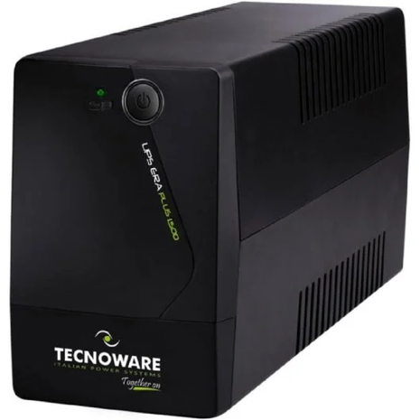

# Solució  
# Passes a seguir

---

# T02: Selecció d’un SAI per una empresa client

---

## 1. Inventari d’equips

- **4 Ordinadors de sobretaula + 4 Monitors**  
  S’han de connectar al SAI per assegurar que els usuaris puguin salvar la feina en cas d’una anada de llum inesperada i tancar els sistemes de manera correcta.

- **Una impressora-fotocopiadora multifunció**  
  Potser no és tan important connectar-la al SAI, ja que normalment no cal que estigui activa durant una interrupció i consumeix molta potència, així podem allargar una mica l’autonomia.

- **Un router d’accés a Internet**  
  Igual que els ordinadors, també és imprescindible, ja que garanteix la connexió a Internet i la comunicació, i sense router, no podem accedir a res a la xarxa per molt que l’ordinador estigui engegat.

| Dispositiu | Potència (W) | Potència (VA) |
|-------------|---------------|----------------|
| [x4 Ordinador HP](https://www.hp.com/es-es/shop/product.aspx?id=BY7B5ET&opt=ABE&sel=DTP) [(+ components)](https://www.hp.com/es-es/shop/product.aspx?id=18H24AA&opt=ABE&sel=ACC) | 150 W | 188 VA |
| [x4 Monitor HP](https://www.hp.com/es-es/shop/product.aspx?id=65P58AA&opt=ABB&sel=MTO) | 20 W | 25 VA |
| [Impressora multifunció](https://www.pccomponentes.com/brother-dcp-l3560cdw-multifuncion-laser-led-color-wifi-duplex) | 150 W (estimat) | 188 VA |
| [Router d’accés a Internet](https://www.amazon.es/TP-Link-AC1200-Router-doble-banda/dp/B08GDC3534?source=ps-sl-shoppingads-lpcontext&ref_=fplfs&smid=A1AT7YVPFBWXBL&language=es_ES&th=1) | 12 W | 15 VA |

---

## 2. Càlcul de potència total

- 4 ordinadors de sobretaula (CPU): `4 × 150 W = 600 W`  
- 4 monitors HP V24i G5: `4 × 20 W = 80 W`  
- 4 conjunts de teclat + ratolí USB: `4 × 2 W = 8 W`  
- 1 router TP-Link Archer C6: `12 W`  
- 1 impressora Brother DCP-L3560CDW: `150 W`  
- Consum addicional previst (marge): `50 W`

**Total:** 900 W  
**Amb reserva del 20%:** 1080 W

---

## 3. Determinació de l’autonomia

En cas de tall de corrent, s’ha establert que el SAI ha de proporcionar una **autonomia mínima d’uns 10 minuts**.  
Aquest temps és suficient per:

- Guardar la feina en curs  
- Tancar correctament els sistemes  
- Evitar pèrdues de dades o danys al maquinari  

La potència total estimada del conjunt d’equips és de **1080 W / 1350 VA**.  
Per això, necessitem un SAI que pugui mantenir aquesta càrrega durant almenys **10 minuts**.

---

## 4. Recerca dels models de SAI

| Model | Potència | Autonomia estimada | Preu aprox. | Observacions |
|--------|-----------|--------------------|--------------|---------------|
| [**Salicru SPS ONE 1500VA**](https://gangaelectronica.es/sais/195980-sai-linea-interactiva-salicru-sps-1500-one-v2-1500va-900w-4-salidas-formato-torre-8436584870210.html?utm_source=chatgpt.com) | 1500 VA / 900 W | 10–12 min a mitja càrrega | 175 € | Marca espanyola, bona relació qualitat/preu |
| [**Riello Sentinel Pro SEP 1500**](https://www.carrefour.es/sai-riello-sentinel-pro-sep-1500-1500va-1350w/8023251002694/p?utm_source=chatgpt.com) | 1500 VA / 1350 W | ≥ 10 min (configurable) | 610 € | Alta qualitat, professional, fiable |
| [**Tecnoware Era Plus 1500VA**](https://www.pccomponentes.com/sai-tecnoware-era-plus-1500-sai-linea-interactiva-1500va-1050w-con-2-salidas-schuko?utm_source=chatgpt.com) | 1500 VA / 900 W | 8–10 min a mitja càrrega | 110 € | Econòmic, per usos d’oficina bàsics |

---

## 5. Informe tècnic

### Càlculs realitzats
S’ha calculat que la potència total dels equips és de **900 W**, afegint un marge del **20%** s’arriba a **1080 W**, equivalent a **1350 VA**.

### Models analitzats
- Salicru SPS ONE 1500VA  
- Riello Sentinel Pro SEP 1500  
- Tecnoware Era Plus 1500VA

### Selecció final
**Recomanació:** [*Tecnoware Era Plus 1500VA*](https://www.pccomponentes.com/sai-tecnoware-era-plus-1500-sai-linea-interactiva-1500va-1050w-con-2-salidas-schuko?utm_source=chatgpt.com)  
Recomano personalment el **Tecnoware Era Plus** per la seva potència i autonomia suficient, que garanteix un ús prolongat sense problemes.  
A més, ofereix una **relació qualitat-preu molt interessant**, ja que no té un preu molt elevat però manté bones característiques comparat amb altres opcions.

 Tecnoware UPS ERA Plus 1500 – SAI line-interactive de 1500 VA / 1050 W amb 2 preses Schuko, protecció contra talls i pujades de tensió, ideal per ordinadors i equips electrònics

--- 
[← Torna a enunciat](README.md)
