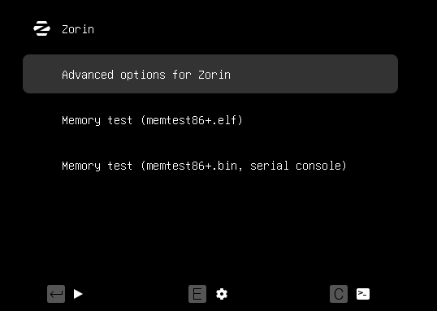

# 🔐 CANVIAR CONTRASENYA

Arrenquem la màquina virtual mantenint premut **Shift** per accedir al mode **Grub**.  
Un cop accedim al menú principal, hem de seleccionar **la primera opció** que apareix a la llista, ja que aquesta ens permetrà accedir a les opcions avançades del sistema.



Quan apareix el menú a la pantalla, hem de seleccionar **la segona opció disponible**, que correspon al **mode de recuperació**.


Dins del menú de recuperació, seleccionarem l’opció anomenada **root**, que en versions anteriors del sistema podia aparèixer amb el nom de **netroot**.  
Aquesta opció ens permetrà accedir al sistema amb permisos d’administrador per fer canvis avançats.


Tenim el terminal obert en **mode root**, però si intentem canviar la contrasenya amb `passwd`, surt un error perquè el sistema està en **mode només lectura**.  
Per arreglar-ho, hem de posar el sistema en **mode lectura i escriptura** abans de canviar la contrasenya.


Ara ja podem canviar sense problemes la contrasenya de l’usuari que vulguem, la del **root**, o fins i tot **crear un usuari nou**.  
Si no sabem exactament quin és el nom d’usuari, podem utilitzar aquest comandament per veure tots els usuaris del sistema:

```bash
cut -d: -f1 /etc/passwd
Exemple: usuari1234


Un cop acabats tots els canvis, podem reiniciar el sistema fàcilment escrivint la comanda:

bash
Copia el codi
reboot
Això farà que l’equip es reiniciï i arrenqui amb les noves configuracions aplicades.

🧱 FORTIFICACIÓ ACCÉS GRUB
Per definir els usuaris i les contrasenyes que podran utilitzar la línia de comandes del GRUB, així com executar i editar les seves entrades, primer hem d’obrir una terminal i executar la comanda següent:


Un cop hem obert l’editor de text nano, ens desplacem fins al final del fitxer i hi afegim la llista d’usuaris i contrasenyes introduint el següent text:

bash
Copia el codi
cat << EOF
set superusers="root,miquel"
password root 1234
password miquel 4321
EOF
S’han creat dos usuaris, root i joan, amb les contrasenyes 1234 i 4321.
Les parts en blau són les que heu de canviar segons els usuaris i contrasenyes que vulgueu posar.


Les contrasenyes d’usuari creades al pas anterior apareixen en text pla al fitxer /etc/grub.d/00_header, cosa insegura.
Per solucionar-ho, cal generar un hash que amagui aquestes contrasenyes.


Després d’executar l’ordre per generar el hash, la terminal sol·licita la contrasenya i cal introduir-la dues vegades.
S’ha de fer per a l’usuari miquel i, després, per root; en prémer Enter la terminal genera el hash (no es mostra el hash en el text).


Un cop hem obtingut els hash, només cal substituir la contrasenya creada pel hash.
Per fer-ho, obrim la terminal d’abans:

bash
Copia el codi
sudo nano /etc/grub.d/00_header
I executem la comanda corresponent.


Finalment, per aplicar els canvis i actualitzar la configuració del GRUB, cal executar una comanda des del terminal.


🎥 ENLLAÇ VIDEO COMPROVACIÓ
https://drive.google.com/file/d/1uMsfTNb0t25CtGzDwg22LnQSt3EKn-am/view?usp=sharing

📚 FONTS D’INFORMACIÓ
https://geekland.eu/proteger-el-grub-con-contrasena/

https://waytoit.wordpress.com/2013/06/06/recuperando-password-en-ubuntu/
